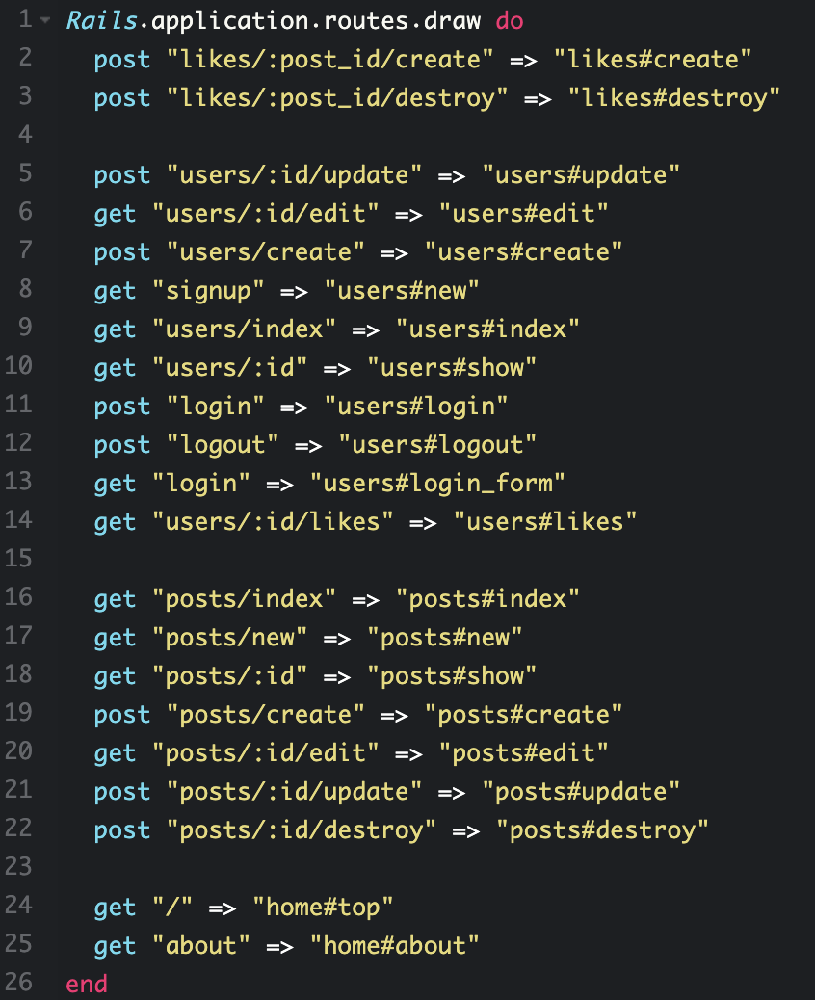
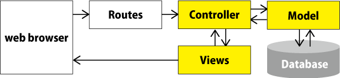

# Ruby on Railsの事前知識
Ruby on Rails（Rails）は、Rubyにより構築されたWEBアプリケーションフレームワークです。
Webアプリケーションの開発を始めるうえで必要となる作業やリソースを事前に仮定して準備しておくことで、Webアプリケーションを少ないコードでより簡単に構築できるように設計されています。

これからRailsを学ぶ上で、最初に押さえておきたいポイントなどをまとめます。

# Ruby on Railsでできること
### Webシステムの開発
Railsを使えば素早く簡単にWebシステムを開発できます。  
どんなWebシステムが開発できるのかいくつか例を見てみましょう。  

・ブログサイト  
・ショッピング(EC)サイト  
・ニュースサイト  
・SNS  
・マッチングサイト  

具体例：  
・クックパッド  
・Airbnb  
・グノシー  
・Wantedly  
・GitHub  

もちろん他にも自分が思い描いた新しいサービスを開発することも可能です。  
Ruby on Railsをしっかり学んで何をしたいのか、どうやって実現させられるのかを思い描いて開発に取り組めるようになってください。  

### サーバー側処理システムの開発
スマホゲームアプリのブラウザ側を別の言語で開発しても、サーバー側の処理システムを分担した開発をRailsで担当できます。

### イントラネットの開発
企業内部で業務システムを利用するためのクラウド型グループウェアを開発できます。  
社内SNSや電子メール、スケジュール管理、ドキュメント共有、ワークフロー、勤怠管理、テレビ会議など様々な機能を組み込めます。  

# Railsの特徴
### ジェネレーター
ジェネレーターとは、開発を進める上である程度同じコードを書かなければいけないような単純作業をコマンド一つで骨組みを用意してくれる便利な機能です。  

たとえば、クラス定義やマイグレーションコードやディレクトリやファイル生成などがあります。  

`＄rails generate 〜` または、 `＄rails g 〜`　に続いてコマンドを入力して用途にあった骨組みを用意できます。  

generateコマンドには scaffold, controller, model, migration がよく使われます。  
また、ジャネレーターをカスタイズして任意の骨組みを用意することもできます。  

### ルーティング
ルーティングは、ユーザーが指定のURLに移動した際に指定のアクションが実行されるように、紐付け（ルートを設定）しておくことを言います。ルーティングは、Rails開発でMVCに並ぶ重要な基本要素です。  

ルーティングの例：
 

開発を進めるとこのようなルーティングを必要な分だけ記述していくことになりますが、
ルーティング設定で記述するコード自体はとても少なく簡単なのでしっかり仕組みを理解するようにしてください。  

### MVC
Railsのフレームワークでは、MVCの概念を採用しています。  
MVCとは、ソフトウェアを実装するためにプログラムを3つの要素、Model（モデル）、View（ビュー）、Controller（コントローラ）に分割したデザインパターンです。  

  

各要素には役割が分担されています。  
開発を進めていく上でこの役割を常に意識することで、自分が今どの要素の作業をしているのか把握できるようになり、開発をスムーズに進めることに役立ちます。  

### データベース
RailsはSQLを意識せずにデータベースを扱う事が可能にするActiveRecordを採用しています。  
データベースには様々なオープンソースで提供されるRDB（リレーショナル・データベース）が存在しています。  
MySQL、PostgreSQL、SQLite、SQL Server、Sybase, Oracleなど  

### Gem
正式名称はRubyGems：https://rubygems.org  
Ruby言語用のライブラリをインストールして簡単に機能を追加できるパッケージ管理ツールです。  
Gemのインストールは、基本的にコマンドプロンプトもしくはターミナルを利用します。  

Gemのおかげで初心者でもクレジットカード決済機能やユーザー管理、パスワードの暗号化など、様々な機能を簡単にインストールして実装できることが最大のメリットです。  

違う言語で同じようなパッケージ管理ツールとしては、JavaScript用のnpm、web用のbower、iOSアプリ用のswift-package-manager、PHP用のcomposerがあります。  

# Railsを理解するために基礎的な知識
### DRY
Don’t Repeat Yourselfとは、「同じことを繰り返さない」という原則です。  
Andy HuntとDave Thomasが書籍「達人プログラマー―システム開発の職人から名匠への道」で提唱したソフトウェア開発原則。WebフレームワークRuby on Railsが基本理念のひとつとして採用している有名なソフトウェア開発原則です。  

具体的に、「同じことを繰り返さない」とはどういった事でしょうか。  
それは「ソースコードを重複させない」だけに留まらず、ドキュメント、DBスキーマ、テスト、ビルドシステムなど、ソフトウェア開発全体において「同じことを繰り返さない」という原則を意識するようにしてください。  

### CoC
Convention over Configuration（CoC）は「設定より規約が優先される」と訳されます。  
このCoCは、開発者がこの規約に従い制約を設けることでシンプルかつ、実装に集中することができます。  

具体的なメリットについて、開発者独自の設定ファイルを書かなくて済んだり、他のエンジニアと共通ルールでコミュニケーションがとれるといったメリットがあります。  

### CRUD
新規作成(Create)、表示(Read)、更新(Update)、削除(Delete)のそれぞれの頭文字を合わせてCRUDと呼ばれています。  
データベースに関する基本的な動作で、Railsに限らずソフトウェア開発はこの四つの機能で基本作成されていると言われています。  

### Active Record
オブジェクト指向言語におけるオブジェクトと、リレーショナルデータベースのレコードを対照させることで、リレーショナルデータベースのレコードがオブジェクトとして直感的に扱えるようにするデザインパターンをActive Recordパターンと呼び、それをRuby言語向けに当てはめたライブラリがActive Recordです。  

Active RecordはRDB（リレーショナルデータベース）から読み出したデータをオブジェクトにしたり、オブジェクトからRDB（リレーショナルデータベース）に書き込む記述を容易にすることが可能となります。  

Active Recordの主な機能  
・マイグレーション  
・バリデーション  
・アソシエーション  
・コールバック  
・クエリインターフェイス  

詳しい内容はこれから学んでいきますが、Active Recordの役割といくつかの機能が存在することを認識しておいてください。　　

### Cookies
Ruby on Railsでは、cookiesメソッドでcookie情報を保存することができます。  
セッションハイジャックなどの様々な攻撃を受ける可能性を認識して取り扱いには十分注意することが重要です。  

### ヘルパー
ヘルパーとは、主にViewにおいてある処理をメソッドとして定義することで、いつでもどこでも共通の処理として実行できるようにした機能です。

煩雑になりがちなコードを予め定義しておく事で、開発の生産性をあげるツールになっています。  
Railsではこのヘルパーがいくつか用意されています。また、自分オリジナルのヘルパーを定義することもできます。  

UrlHelper  
link_to 文字列のリンクを生成します。`<%= link_to 表示文字列, 遷移先パス %>`  
button_to ボタンのリンクを生成します。`<%= button_to 表示文字列, 遷移先パス, method: :get %>`  

### テスト（単体テスト、機能テスト、統合テスト）
広義のソフトウェアテストは人間の目視による確認も含めて、ソフトウェア全体をどのように動作確認するのかは、これまでのシステム開発の歴史で常に課題となってきた問題です。  
Railsでは、テスト用のフレームワークを用いてテストコードを記述、実行させることで自動でテストを行えるようになります。  
どこまで広く深くテストするのかなど、具体的な手法や範囲は今後学んでいくことになります。  
開発を進めていく過程で下記の主なテスト内容を実施することになります。  

単体テスト（Unit test） - モデルやビューヘルパー単体の動作をチェックを行います。  
機能テスト (functional test) - コントローラーの動作や、ビューの出力結果をチェックします。  
結合テスト（Integration test） - ソフトウェアの実際の動作の流れに沿った総合的なテスト  

