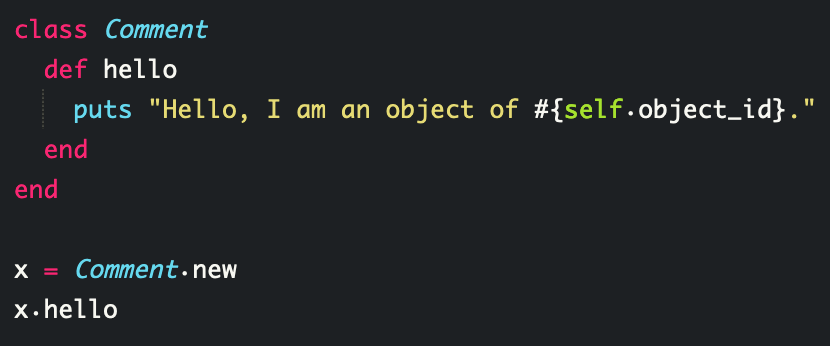
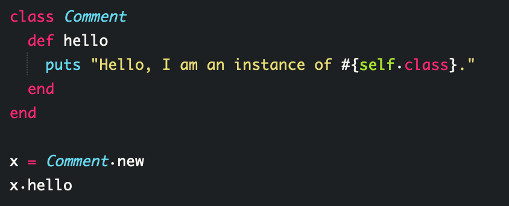

> selfはインスタンスオブジェクト自身を指しています。  
クラスの中でインスタンスオブジェクトを呼び出す際やそのインスタンスオブジェクトを呼び出す際は、selfを使用します。

## selfとは

selfはインスタンスオブジェクト自身を指しています。  
クラスの中でインスタンスオブジェクトを呼び出す際やそのインスタンスオブジェクトを呼び出す際は、selfを使用します。

### クラスの中でインスタンスオブジェクトを呼び出す例。
 

`"Hello, I am an object of 43074640."`  
この場合、selfは省略可能ですが、習慣的に記述するように心がけてください。  
次に省略不可の場合を見てみましょう。

### インスタンスオブジェクトを呼び出す例。
 

`"Hello, I am an instance of Comment."`  
この場合、class定義と判定されてSyntaxErrorが出ます。  

selfを表記しないことでエラーや、思い通りに対象を呼び出しできなくなる場合があるので注意してください。  
しっかりクラス内でメソッドが処理する対象としてselfを表記し、対象のインスタンスオブジェクトが指定される状態にしてください。