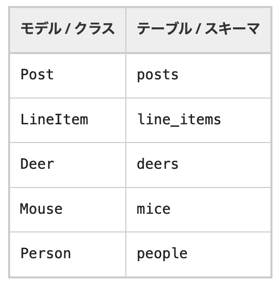

>Railsにおける、「単数」と「複数」の使い分けについての説明です。
>
>例えばコントローラー作成時は"blogs"と、モデル作成時は"blog”とそれぞれパラメーター指定させています。それに基づいて様々な変数等が自動的に作成されているようなので、"blogs"と"blog"を使い分けることに意味があるのだと思うのですが、何処にも記載が無いので未だに混乱しています。
>
>rake routes"を行ってみても、Prefixに"blog"　”new_blog"もあれば、"blogs" "confirm_blogs"もあります。何故こうなっているのか全く理解できていません。

#  
## Railsの命名規則
### Prefixの命名について
自動生成したルーティングのPrefix名はRialsの仕様による「単数形」「複数形」の概念があります。  
あとからPrefix名を変えることもできますが、さまざまな自動化のメリットを享受するために意図なく変更することは避けましょう。  

Prefixの命名について、下表にある"users"と"user"の違いはURIを見れば違いを理解できそうです。
":id"があるRUIには単数形で命名されていますね。これはリソースを操作する状況を考えるとより理解できると思います。
このアクションを実行する際、idを参照するページはユーザー固有のページとなるので"edit_user"と「単数形」となりますね。

 

### コントローラの命名規則
コントローラ名は、基本的に名前の最後の部分に「複数形」を使います。  

これは絶対的に守らなければならないというものではありません。  
しかし、CoC（Convention over Configuration）の理念の則り規約を守るようにしてください。  

例えば、resourcesメソッドを利用すれば自動でRESTfulなルート定義を生成できます。  
この時、コントローラ名の最後が複数形になっていないと、resourcesなどのデフォルトのルーティングジェネレータがそのまま利用できないので簡単に一括ルーティングできず、:pathや:controllerをいちいち自分で指定しなければなりません。

ルートの確認やURLの紐付け指定など無用な作業を自分自身で行わなければならないので、これだけでも規則を遵守するメリットはあると思います。

[コントローラーの命名規則](https://railsguides.jp/action_controller_overview.html#%E3%82%B3%E3%83%B3%E3%83%88%E3%83%AD%E3%83%BC%E3%83%A9%E3%81%AE%E5%91%BD%E5%90%8D%E8%A6%8F%E5%89%87)  

### モデルの命名規則
モデルのクラス名は、**必ず**「単数形」で「頭文字が大文字」にします。  

Railsの仕様として、データベースのテーブル名を探索するときに、モデルのクラス名を複数形にした名前で探索します。  
モデル作成時に複数形にしてしまうと、任意で指定したモデル名と異なるモデル名で作成されてしまうこともあります。  
（「△△△△s」 という複数形とシステム側で誤認識されてしまうようなモデル名だと「△△△△」のように誤変換して作成されてしまう場合もあります。）

 

[モデルの命名規則](https://railsguides.jp/active_record_basics.html#%E5%91%BD%E5%90%8D%E3%83%AB%E3%83%BC%E3%83%AB)  